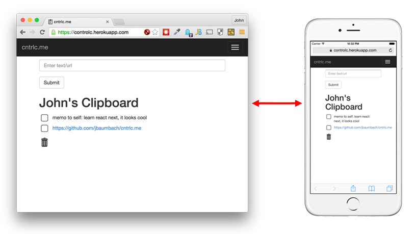

cntrlc.me
=========

The simple demo solves a common problem.  What do you do when you have a link on your phone and want to put it on your 
computer, or vice versa?  Usually I email it to myself, but that's a bit of a hassle.  With cntrlc.me, 
you just open the site in a browser on both devices and copy the link in.  The link instantly appears on the other 
device.  It works across any and all platforms and you don't need to install anything.

Facebook login makes security quick and easy, and no Facebook permissions are asked for.

This demo shows implementations of a "REAN" stack:

* Redis database
* Express 4 backend
* Angular.js frontend
* Node.js

With some bonus features:

* Facebook Login
* Socket.io messaging
* Mocha/Supertest tests

Check out a live demo running on Heroku: [http://cntrlc.me](http://cntrlc.me)

License
-------
Copyright (c) 2015 John Baumbach <john.j.baumbach@gmail.com>

This program is free software: you can redistribute it and/or modify it under the terms of the GNU General Public License as published by the Free Software Foundation, either version 3 of the License, or (at your option) any later version.

This program is distributed in the hope that it will be useful, but WITHOUT ANY WARRANTY; without even the implied warranty of MERCHANTABILITY or FITNESS FOR A PARTICULAR PURPOSE.  See the GNU General Public License for more details.

You should have received a copy of the GNU General Public License along with this program.  If not, see <http://www.gnu.org/licenses/>.

